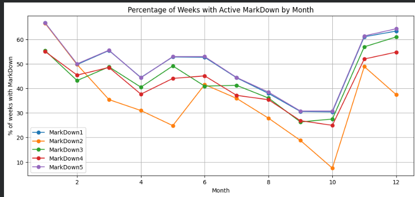

# project--DS512-513
 Dataset Description

ข้อมูลเป็น **Walmart Weekly Sales Dataset**  
ช่วงเวลา: **2010 – 2012**

###  Target Variable
- **Weekly_Sales** : ยอดขายรายสัปดาห์ของแต่ละแผนกในแต่ละสาขา

---

## Data Dictionary

| ชื่อตัวแปร | ประเภท | คำอธิบาย |
|-----------|--------|----------|
| Store | Integer | รหัสสาขาของ Walmart แต่ละสาขามีลักษณะและขนาดแตกต่างกัน ส่งผลให้รูปแบบยอดขายแตกต่างกัน |
| Dept | Integer | รหัสแผนกภายในสาขา ยอดขายของแต่ละแผนกมีความแตกต่างสูงและมี variance ไม่เท่ากัน |
| Date | Date | วันที่ของสัปดาห์ ใช้สำหรับวิเคราะห์แนวโน้มตามเวลาและฤดูกาล (Seasonality) |
| Weekly_Sales | Float | **ตัวแปรเป้าหมาย (Target)** แสดงยอดขายรวมรายสัปดาห์ของแต่ละสาขาและแผนก พบว่ามีการกระจายกว้างและมี outlier |
| IsHoliday | Boolean | ระบุว่าสัปดาห์นั้นมีวันหยุดสำคัญหรือไม่ ข้อมูลส่วนใหญ่เป็นช่วงที่ไม่ใช่วันหยุด |
| Temperature | Float | อุณหภูมิเฉลี่ยของพื้นที่ มีความสัมพันธ์กับยอดขายค่อนข้างต่ำเมื่อพิจารณาแบบเชิงเส้น |
| Fuel_Price | Float | ราคาน้ำมันในช่วงเวลานั้น มีความสัมพันธ์กับยอดขายค่อนข้างต่ำ |
| MarkDown1 | Float | มูลค่าโปรโมชั่นประเภทที่ 1 จะมีค่าเฉพาะช่วงที่มีการจัดโปรโมชั่น |
| MarkDown2 | Float | มูลค่าโปรโมชั่นประเภทที่ 2 มีข้อมูลบางช่วงเท่านั้น (missing value สูง) |
| MarkDown3 | Float | มูลค่าโปรโมชั่นประเภทที่ 3 ใช้ในกิจกรรมส่งเสริมการขายเฉพาะบางช่วง |
| MarkDown4 | Float | มูลค่าโปรโมชั่นประเภทที่ 4 มีความผันผวนสูง และมีค่าผิดปกติในบางช่วง |
| MarkDown5 | Float | มูลค่าโปรโมชั่นประเภทที่ 5 มักเกี่ยวข้องกับช่วงปลายปีหรือเทศกาล |
| CPI | Float | ดัชนีราคาผู้บริโภค (Consumer Price Index) แสดงภาวะเงินเฟ้อ มีผลต่อยอดขายในภาพรวมแต่ไม่เด่นชัดรายสัปดาห์ |
| Unemployment | Float | อัตราการว่างงานของพื้นที่ มีการเปลี่ยนแปลงช้า และมีผลต่อยอดขายในระยะยาวมากกว่าระยะสั้น |
| Size | Integer | ขนาดของสาขา สาขาขนาดใหญ่มักสร้างยอดขายรวมสูงกว่า |
| Type | Category | ประเภทของสาขา (A, B, C) โดย Type A เป็นสาขาขนาดใหญ่และพบมากที่สุดในชุดข้อมูล |

## อธิบาย Data เพิ่มเติม
 - **Type A**  
 
  เป็นสาขาขนาดใหญ่ที่สุด โดยมีขนาดเฉลี่ยประมาณ **182,231 ตารางฟุต**  
  และมีค่ามัธยฐานสูงถึง **202,505 ตารางฟุต**  
  สะท้อนว่า Type A ส่วนใหญ่เป็นสาขาขนาดใหญ่จริง ไม่ได้เกิดจาก outlier เพียงบางจุด  
  นอกจากนี้ยังมีขนาดสูงสุดถึง **219,622 ตารางฟุต**

- **Type B**  

  เป็นสาขาขนาดกลาง มีขนาดเฉลี่ยประมาณ **101,819 ตารางฟุต**  
  ค่ามัธยฐานอยู่ที่ **114,533 ตารางฟุต**  
  แสดงให้เห็นว่า Type B มีความหลากหลายของขนาดมากกว่า Type C แต่เล็กกว่า Type A อย่างชัดเจน

- **Type C**  
  เป็นสาขาขนาดเล็กที่สุด โดยมีขนาดเฉลี่ยเพียง **40,536 ตารางฟุต**  
  และค่ามัธยฐานประมาณ **39,910 ตารางฟุต**  
  ช่วงการกระจายของขนาดแคบมาก สะท้อนว่า Type C มีโครงสร้างร้านที่ค่อนข้างสม่ำเสมอ


## MarkDown1
พบการใช้งานในสัดส่วนค่อนข้างสูง และมีความถี่เพิ่มขึ้นชัดเจนในช่วงต้นปีและปลายปี
ขณะที่ลดลงในช่วงกลางถึงปลายไตรมาสที่ 3  
สะท้อนว่า MarkDown1 น่าจะเป็นโปรโมชั่นหลักที่ใช้กระตุ้นยอดขายในช่วง High Season
หรือช่วงเทศกาลที่มีกำลังซื้อสูง

### MarkDown2
เป็น MarkDown ที่ถูกใช้งานน้อยที่สุดเมื่อเทียบกับตัวอื่น
และมีช่วงเวลาที่แทบไม่ถูกใช้งาน โดยเฉพาะในช่วงกันยายน–ตุลาคม  
อาจสะท้อนว่าเป็นโปรโมชั่นเฉพาะกรณี
หรือใช้กับสินค้าหรือสถานการณ์ที่จำกัดมากกว่าตัวอื่น

### MarkDown3
มีรูปแบบการใช้งานใกล้เคียงกับ MarkDown1
แต่ความถี่และความสม่ำเสมอน้อยกว่า  
อาจเป็นโปรโมชั่นรอง ที่ใช้สนับสนุนการขายในบางช่วง
มากกว่าการเป็นตัวขับเคลื่อนยอดขายหลัก

### MarkDown4
มีการใช้งานค่อนข้างสม่ำเสมอตลอดทั้งปี
โดยไม่พบช่วงที่มีการใช้งานพุ่งสูงอย่างชัดเจน  
บ่งชี้ว่า MarkDown4 อาจเป็นโปรโมชั่นเชิงควบคุม
ที่ใช้เพื่อรักษาระดับยอดขาย มากกว่าการเร่งยอดขายแบบเฉียบพลัน

### MarkDown5
เป็น MarkDown ที่ถูกใช้งานในสัดส่วนสูง
และมีรูปแบบ Seasonality ชัดเจน โดยเฉพาะช่วงปลายปี  
มีแนวโน้มเป็นโปรโมชั่นที่เกี่ยวข้องกับช่วงเทศกาล
หรือช่วงที่ต้องการกระตุ้นยอดขายในวงกว้าง


### CPI (Consumer Price Index)  และ Unemployment 
  เป็นตัวแปรเชิงเศรษฐกิจ  
  มีลักษณะแตกต่างจากตัวแปรด้านโปรโมชั่นหรือโครงสร้างร้าน 
  จากการสํารวจข้อมูลพบว่า ค่า CPI และอัตราการว่างงาน **ไม่ได้เปลี่ยนแปลงในระดับรายสัปดาห์อย่างรวดเร็ว**
  ค่าเหล่านี้มีแนวโน้ม **เปลี่ยนตามช่วงเวลา (Date)** และ **พื้นที่หรือสาขา (Store/Region)** มากกว่าการเปลี่ยนแบบเฉพาะกิจ
จากการสำรวจข้อมูลพบว่า  
- ค่า CPI มีการเปลี่ยนแปลงแบบค่อยเป็นค่อยไป สะท้อนภาวะเงินเฟ้อในแต่ละช่วงเวลา  
- ค่า Unemployment มีการเปลี่ยนแปลงช้ากว่ายอดขาย และสะท้อนสภาพเศรษฐกิจในภาพรวมของพื้นที่ที่แต่ละสาขานั้นๆตั้งอยู่
---

## Exploratory Data Analysis (EDA)

### 1. ภาพรวมยอดขายทั้งหมด (Total Weekly Sales)


**คำอธิบาย:**  
แสดงแนวโน้มยอดขายรวมรายสัปดาห์ของ Walmart ตลอดช่วงเวลา  
พบว่ายอดขายมีความผันผวน และมีบางช่วงที่ยอดขายสูงขึ้นอย่างชัดเจน  
ซึ่งมักเกิดในช่วงเทศกาลหรือวันหยุดสำคัญ

---

### 2. ยอดขายแยกตามแผนก (Weekly Sales by Department)


**คำอธิบาย:**  
แสดงการกระจายยอดขายของแต่ละแผนก  
พบว่าแต่ละแผนกสร้างยอดขายไม่เท่ากัน  
สะท้อนถึงความสำคัญของการบริหารสินค้าในแต่ละหมวดสินค้า

---

### 3. เปรียบเทียบยอดขายช่วงวันหยุด vs ไม่ใช่วันหยุด
---

### 4️⃣ Correlation Matrix


**คำอธิบาย:**  
แสดงความสัมพันธ์ระหว่างตัวแปรเชิงตัวเลขกับยอดขาย  
พบว่าตัวแปรเศรษฐกิจส่วนใหญ่มีความสัมพันธ์กับ Weekly_Sales
ในระดับต่ำถึงปานกลาง และไม่เป็นความสัมพันธ์เชิงเส้นที่รุนแรง

---

### 5️⃣ Dashboard Overview


**คำอธิบาย:**  
Dashboard สรุปภาพรวมข้อมูลยอดขาย แนวโน้ม และการกระจายตัวของข้อมูล  
ช่วยให้เข้าใจภาพรวมเชิงธุรกิจได้รวดเร็วในมุมมองเดียว

---

##  Key Findings

- ยอดขายได้รับผลกระทบจากช่วงเวลาและวันหยุดอย่างชัดเจน  
- ความแตกต่างของแผนกมีผลต่อยอดขายมากกว่าปัจจัยเศรษฐกิจ  
- ข้อมูลมีความซับซ้อนและไม่เป็นเชิงเส้นทั้งหมด  

---

##  Future Work

- พัฒนาโมเดล Machine Learning เพื่อพยากรณ์ยอดขาย  
- ทดลองโมเดลที่สามารถจับความสัมพันธ์แบบไม่เชิงเส้น  
- เพิ่ม Feature Engineering เพื่อปรับปรุงประสิทธิภาพของโมเดล

##  Project Structure

```text
project--DS512-513/
│
├── data/          # ไฟล์ข้อมูล
├── notebook/      # Jupyter Notebook
├── picture/       # รูปกราฟที่ใช้ใน EDA
│   ├── dashboard.png
│   ├── correlation metrix.png
│   ├── totol_weeklysales.png
│   ├── weekly_sales_department.png
│   └── weely_sales_holiday_vs_non.png
│
└── README.md
