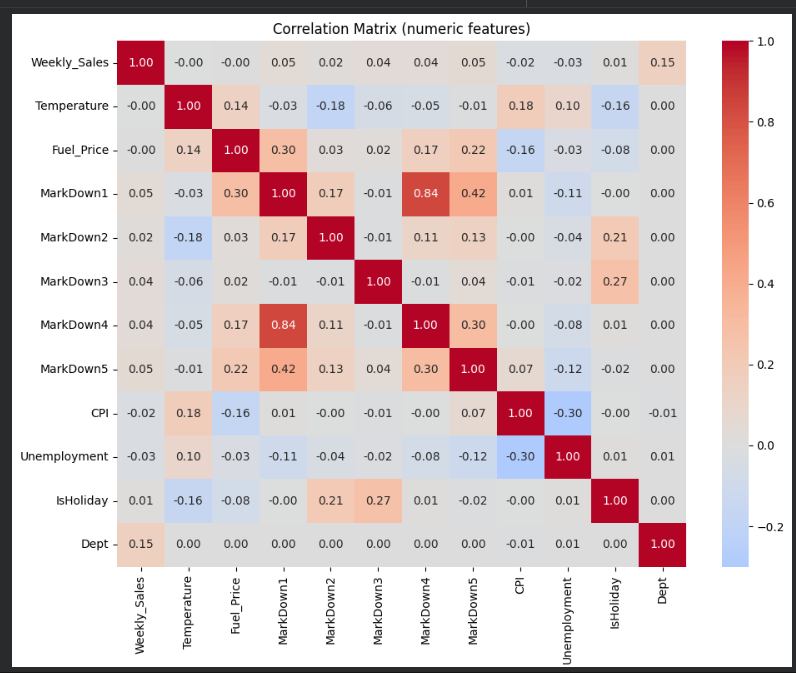
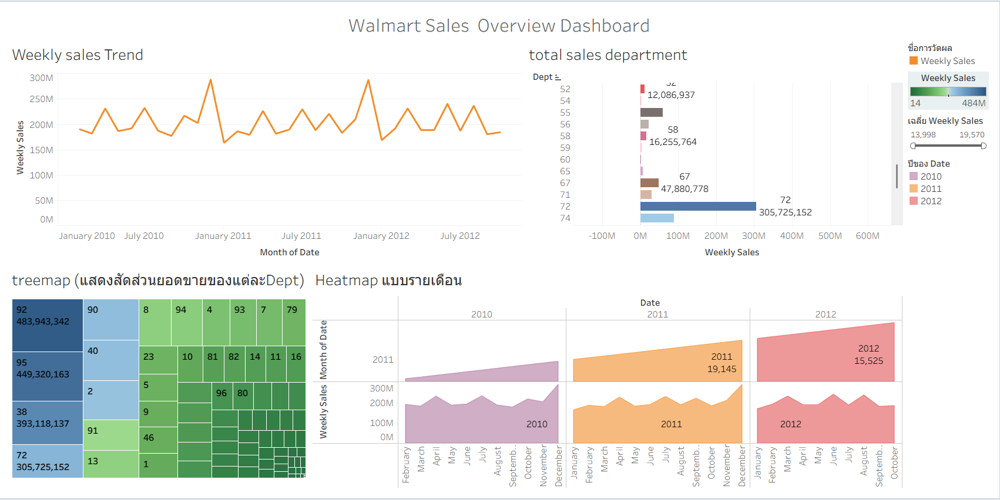

# project--DS512-513
 Dataset Description

ข้อมูลเป็น **Walmart Weekly Sales Dataset**  
ช่วงเวลา: **2010 – 2012**

###  Target Variable
- **Weekly_Sales** : ยอดขายรายสัปดาห์ของแต่ละแผนกในแต่ละสาขา

---

##  Data Dictionary

| Column Name | Type | Description |
|------------|------|------------|
| Store | Integer | รหัสสาขา |
| Dept | Integer | รหัสแผนก |
| Date | Date | วันที่ของสัปดาห์ |
| Weekly_Sales | Float | ยอดขายรายสัปดาห์ |
| IsHoliday | Boolean | ระบุว่าสัปดาห์นั้นเป็นวันหยุดหรือไม่ |
| Temperature | Float | อุณหภูมิ |
| Fuel_Price | Float | ราคาน้ำมัน |
| MarkDown1–5 | Float | มูลค่าโปรโมชั่น |
| CPI | Float | ดัชนีราคาผู้บริโภค |
| Unemployment | Float | อัตราการว่างงาน |
| Size | Integer | ขนาดของสาขา |
| Type | Category | ประเภทของสาขา (A, B, C) |

---

##  Exploratory Data Analysis (EDA)

### 1️⃣ ภาพรวมยอดขายทั้งหมด (Total Weekly Sales)


**คำอธิบาย:**  
กราฟแสดงแนวโน้มยอดขายรวมของ Walmart ในแต่ละช่วงเวลา  
พบว่ายอดขายมีความผันผวน และมีบางช่วงที่ยอดขายสูงขึ้นอย่างชัดเจน
ซึ่งมักเกิดในช่วงเทศกาลหรือวันหยุดสำคัญ

---

### 2️⃣ ยอดขายแยกตามแผนก (Weekly Sales by Department)


**คำอธิบาย:**  
แสดงการกระจายยอดขายของแต่ละแผนก  
พบว่าแต่ละแผนกสร้างยอดขายไม่เท่ากัน
สะท้อนถึงความสำคัญของการบริหารสินค้าในแต่ละหมวด

---

### 3️⃣ เปรียบเทียบยอดขายช่วงวันหยุด vs ไม่ใช่วันหยุด


**คำอธิบาย:**  
ยอดขายในช่วงวันหยุดมีค่าเฉลี่ยสูงกว่าสัปดาห์ปกติ  
แสดงให้เห็นว่าพฤติกรรมผู้บริโภคในช่วงเทศกาล
ส่งผลต่อยอดขายอย่างมีนัยสำคัญ

---

### 4️⃣ Correlation Matrix



**คำอธิบาย:**  
แสดงความสัมพันธ์ระหว่างตัวแปรเชิงตัวเลขกับยอดขาย  
พบว่าตัวแปรเศรษฐกิจส่วนใหญ่มีความสัมพันธ์กับ Weekly_Sales
ในระดับต่ำถึงปานกลาง และไม่เป็นความสัมพันธ์เชิงเส้นที่รุนแรง

---

### 5️⃣ Dashboard Overview



**คำอธิบาย:**  
Dashboard สรุปภาพรวมข้อมูลยอดขาย แนวโน้ม และการกระจายตัวของข้อมูล  
ช่วยให้เข้าใจภาพรวมเชิงธุรกิจได้รวดเร็วในมุมมองเดียว

---

##  Key Findings

- ยอดขายได้รับผลกระทบจากช่วงเวลาและวันหยุดอย่างชัดเจน  
- ความแตกต่างของแผนกมีผลต่อยอดขายมากกว่าปัจจัยเศรษฐกิจ  
- ข้อมูลมีความซับซ้อนและไม่เป็นเชิงเส้นทั้งหมด  

---

##  Future Work

- พัฒนาโมเดล Machine Learning เพื่อพยากรณ์ยอดขาย  
- ทดลองโมเดลที่สามารถจับความสัมพันธ์แบบไม่เชิงเส้น  
- เพิ่ม Feature Engineering เพื่อปรับปรุงประสิทธิภาพของโมเดล

##  Project Structure

```text
project--DS512-513/
│
├── data/          # ไฟล์ข้อมูล
├── notebook/      # Jupyter Notebook
├── picture/       # รูปกราฟที่ใช้ใน EDA
│   ├── dashboard.png
│   ├── correlation metrix.png
│   ├── totol_weeklysales.png
│   ├── weekly_sales_department.png
│   └── weely_sales_holiday_vs_non.png
│
└── README.md
